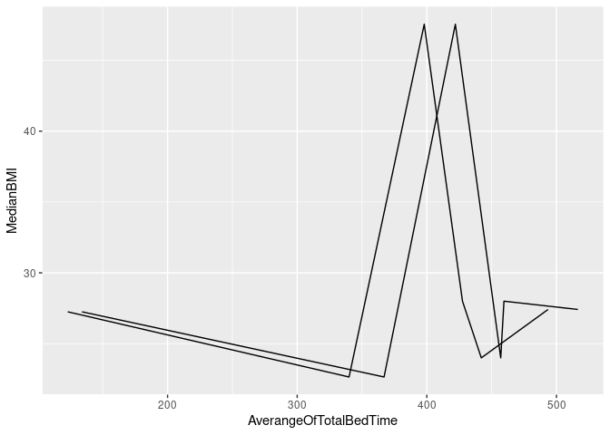

## Sleep Vs Weight

Let’s find the correlation between sleep and relative body weight(BMI).

First import the necessary data from respective csv files.

    library(tidyverse,quietly = TRUE)

    ## ── Attaching packages ─────────────────────────────────────── tidyverse 1.3.1 ──

    ## ✓ ggplot2 3.3.5     ✓ purrr   0.3.4
    ## ✓ tibble  3.1.6     ✓ dplyr   1.0.7
    ## ✓ tidyr   1.1.4     ✓ stringr 1.4.0
    ## ✓ readr   2.1.1     ✓ forcats 0.5.1

    ## ── Conflicts ────────────────────────────────────────── tidyverse_conflicts() ──
    ## x dplyr::filter() masks stats::filter()
    ## x dplyr::lag()    masks stats::lag()

    weightinf = read_csv("fitbitdat/weightLogInfo_merged.csv")

    ## Rows: 67 Columns: 8

    ## ── Column specification ────────────────────────────────────────────────────────
    ## Delimiter: ","
    ## chr (1): Date
    ## dbl (6): Id, WeightKg, WeightPounds, Fat, BMI, LogId
    ## lgl (1): IsManualReport

    ## 
    ## ℹ Use `spec()` to retrieve the full column specification for this data.
    ## ℹ Specify the column types or set `show_col_types = FALSE` to quiet this message.

    sleepday = read_csv("fitbitdat/sleepDay_merged.csv")

    ## Rows: 413 Columns: 5

    ## ── Column specification ────────────────────────────────────────────────────────
    ## Delimiter: ","
    ## chr (1): SleepDay
    ## dbl (4): Id, TotalSleepRecords, TotalMinutesAsleep, TotalTimeInBed

    ## 
    ## ℹ Use `spec()` to retrieve the full column specification for this data.
    ## ℹ Specify the column types or set `show_col_types = FALSE` to quiet this message.

Let’s get some basic info about the data we just imported.

    weightinf$Id = as.character(weightinf$Id)
    sleepday$Id = as.character(sleepday$Id)
    print(head(sleepday))

    ## # A tibble: 6 × 5
    ##   Id         SleepDay          TotalSleepRecor… TotalMinutesAsle… TotalTimeInBed
    ##   <chr>      <chr>                        <dbl>             <dbl>          <dbl>
    ## 1 1503960366 4/12/2016 12:00:…                1               327            346
    ## 2 1503960366 4/13/2016 12:00:…                2               384            407
    ## 3 1503960366 4/15/2016 12:00:…                1               412            442
    ## 4 1503960366 4/16/2016 12:00:…                2               340            367
    ## 5 1503960366 4/17/2016 12:00:…                1               700            712
    ## 6 1503960366 4/19/2016 12:00:…                1               304            320

    print(head(weightinf))

    ## # A tibble: 6 × 8
    ##   Id         Date      WeightKg WeightPounds   Fat   BMI IsManualReport    LogId
    ##   <chr>      <chr>        <dbl>        <dbl> <dbl> <dbl> <lgl>             <dbl>
    ## 1 1503960366 5/2/2016…     52.6         116.    22  22.6 TRUE            1.46e12
    ## 2 1503960366 5/3/2016…     52.6         116.    NA  22.6 TRUE            1.46e12
    ## 3 1927972279 4/13/201…    134.          294.    NA  47.5 FALSE           1.46e12
    ## 4 2873212765 4/21/201…     56.7         125.    NA  21.5 TRUE            1.46e12
    ## 5 2873212765 5/12/201…     57.3         126.    NA  21.7 TRUE            1.46e12
    ## 6 4319703577 4/17/201…     72.4         160.    25  27.5 TRUE            1.46e12

    print(summary(sleepday))

    ##       Id              SleepDay         TotalSleepRecords TotalMinutesAsleep
    ##  Length:413         Length:413         Min.   :1.000     Min.   : 58.0     
    ##  Class :character   Class :character   1st Qu.:1.000     1st Qu.:361.0     
    ##  Mode  :character   Mode  :character   Median :1.000     Median :433.0     
    ##                                        Mean   :1.119     Mean   :419.5     
    ##                                        3rd Qu.:1.000     3rd Qu.:490.0     
    ##                                        Max.   :3.000     Max.   :796.0     
    ##  TotalTimeInBed 
    ##  Min.   : 61.0  
    ##  1st Qu.:403.0  
    ##  Median :463.0  
    ##  Mean   :458.6  
    ##  3rd Qu.:526.0  
    ##  Max.   :961.0

    print(summary(weightinf))

    ##       Id                Date              WeightKg       WeightPounds  
    ##  Length:67          Length:67          Min.   : 52.60   Min.   :116.0  
    ##  Class :character   Class :character   1st Qu.: 61.40   1st Qu.:135.4  
    ##  Mode  :character   Mode  :character   Median : 62.50   Median :137.8  
    ##                                        Mean   : 72.04   Mean   :158.8  
    ##                                        3rd Qu.: 85.05   3rd Qu.:187.5  
    ##                                        Max.   :133.50   Max.   :294.3  
    ##                                                                        
    ##       Fat             BMI        IsManualReport      LogId          
    ##  Min.   :22.00   Min.   :21.45   Mode :logical   Min.   :1.460e+12  
    ##  1st Qu.:22.75   1st Qu.:23.96   FALSE:26        1st Qu.:1.461e+12  
    ##  Median :23.50   Median :24.39   TRUE :41        Median :1.462e+12  
    ##  Mean   :23.50   Mean   :25.19                   Mean   :1.462e+12  
    ##  3rd Qu.:24.25   3rd Qu.:25.56                   3rd Qu.:1.462e+12  
    ##  Max.   :25.00   Max.   :47.54                   Max.   :1.463e+12  
    ##  NA's   :65

    print(unique(sleepday$TotalSleepRecords))

    ## [1] 1 2 3

`TotalSleepRecords` is probably the number of time the user is getting
asleep on a day.

First we will aggregate the sleep data by the ID taking the median of
variables.

    sleepday2 <- group_by(sleepday,Id) %>% 
      summarise(AverangeOfTotalBedTime = median(TotalTimeInBed),
                MedianOfTotalSleepTime = median(TotalMinutesAsleep),
                MedianOfTotalSleepRecords = median(TotalSleepRecords),
                Recordstaken=n())
    head(sleepday2)

    ## # A tibble: 6 × 5
    ##   Id         AverangeOfTotalBe… MedianOfTotalSle… MedianOfTotalSle… Recordstaken
    ##   <chr>                   <dbl>             <dbl>             <dbl>        <int>
    ## 1 1503960366               367               340                  1           25
    ## 2 1644430081               148               130.                 1            4
    ## 3 1844505072               961               644                  1            3
    ## 4 1927972279               422               398                  1            5
    ## 5 2026352035               546.              516.                 1           28
    ## 6 2320127002                69                61                  1            1

Now let’s move to weight data to aggregate by ID taking

    weightinf2 <- group_by(weightinf,Id) %>%
      summarise(MedianBMI = median(BMI),
                RecordsTaken = n()
      )
    head(weightinf2)

    ## # A tibble: 6 × 3
    ##   Id         MedianBMI RecordsTaken
    ##   <chr>          <dbl>        <int>
    ## 1 1503960366      22.6            2
    ## 2 1927972279      47.5            1
    ## 3 2873212765      21.6            2
    ## 4 4319703577      27.4            2
    ## 5 4558609924      27.2            5
    ## 6 5577150313      28              1

Here we will perform an inner join(merge the two tables when both table
share a common variable) between `sleepday2` and `weightinf2`.

    df = merge(x=sleepday2[,c(1:4)],y=weightinf2[,c(1,2)],by="Id")
    head(df)

    ##           Id AverangeOfTotalBedTime MedianOfTotalSleepTime
    ## 1 1503960366                  367.0                  340.0
    ## 2 1927972279                  422.0                  398.0
    ## 3 4319703577                  516.5                  493.5
    ## 4 4558609924                  134.0                  123.0
    ## 5 5577150313                  459.5                  427.5
    ## 6 6962181067                  457.0                  442.0
    ##   MedianOfTotalSleepRecords MedianBMI
    ## 1                         1    22.650
    ## 2                         1    47.540
    ## 3                         1    27.415
    ## 4                         1    27.250
    ## 5                         1    28.000
    ## 6                         1    24.000

We will now plot a line graph showing the relationship among the
variables.

    ggplot(data=df)+geom_line(mapping = aes(x=AverangeOfTotalBedTime,
      y=MedianBMI))+ geom_line(mapping = aes(x=MedianOfTotalSleepTime,
                                    y=MedianBMI))

    print(cor(df$AverangeOfTotalBedTime,df$MedianBMI))

    ## [1] 0.09290725

    print(cor(df$MedianOfTotalSleepTime,df$MedianBMI))

    ## [1] 0.08802334

    print(cor(df$MedianOfTotalSleepRecords,df$MedianBMI))

    ## Warning in cor(df$MedianOfTotalSleepRecords, df$MedianBMI): the standard
    ## deviation is zero

    ## [1] NA
